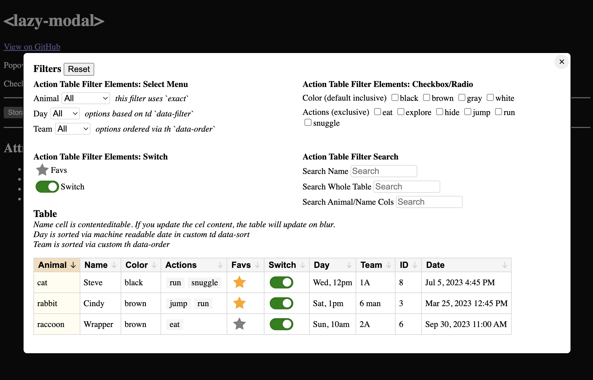

# &lt;lazy-modal&gt; web component

A popover that starts loading related assets (and, optionally, the content inside) when you hover or focus its trigger button(s).

## Demo
[View a demo implementation on CodePen](https://codepen.io/nonsalant/pen/MYwjvoo)

[](https://codepen.io/nonsalant/pen/MYwjvoo)
*The demo shows two 3rd party web components ([storage-form](https://github.com/daviddarnes/storage-form) and [action-table](https://github.com/colinaut/action-table)) lazily loaded from CDNs when opened in modal popovers*

## Attributes
| Attribute        | Description |
|------------------|-------------|
| `triggers`       | Required attribute: A CSS selector for the trigger button(s). |
| `inner-styles`   | A comma-separated list of paths to stylesheets (relative to the lazy-modal.js file or absolute URLs). |
| `inner-scripts`  | A comma-separated list of paths to scripts (relative to the lazy-modal.js file or absolute URLs). |
| `inner-content`  | A path to an HTML file (relative to the lazy-modal.js file) that will be injected into the modal. |
| `popover`        | This [native attribute](https://developer.mozilla.org/en-US/docs/Web/HTML/Reference/Global_attributes/popover) hides the modal before any JS is loaded. You can skip adding this to each modal (because it's added automatically if missing) and add this style somewhere in your CSS to avoid the initial flash of content: <br> `lazy-modal:not(:defined) { display: none; }` |
| `close-button`   | If present adds an "x" button that closes the modal. You can skip this and add it manually (inside the modal element) with something like: <br> `<button onclick="this.closest('[popover]').hidePopover()" type="button"> Close </button>` |
| `in-head`        | If present, the modal's styles and scripts will be added to the `<head>` of the document instead of inside the modal element. |

## Importing the Component

Grab the lazy-modal folder from this repo and include the script:
```html
<script type="module" src="./lazy-modal/lazy-modal.js"></script>
```

Alternatively, you can grab everything as a single JavaScript file from the [CodePen demo](https://codepen.io/nonsalant/pen/MYwjvoo) (all the code in the JS tab), where utility functions are included at the bottom, and the `#closeButton` and `#modalCss` private properties include all the code from the other asset files in the lazy-modal folder.

## Usage

### Basic Usage (content inside the modal HTML)
The paths to for `inner-styles` and `inner-scripts` attributes can be paths relative to the **lazy-modal.js** file, or absolute URLs.
```html
<button class="my-trigger" type="button">Open the Popover</button>
<lazy-modal popover
    triggers=".my-trigger"
    inner-styles="../path/to/my-modal.css"
    inner-scripts="https://example.com/my-modal.js"
    close-button
>
    <!-- HTML goes here -->
</lazy-modal>
```

### Client-Side Rendering the Modal Content
The path for the `inner-content` attribute (pointing to an HTML file) needs to be relative to the **lazy-modal.js** file.
```html
<button class="my-trigger" type="button">Open the Popover</button>
<lazy-modal popover
    triggers=".my-trigger"
    inner-content="../path/to/my-modal.html"
    inner-styles="../path/to/my-modal.css"
    inner-scripts="../path/to/my-modal.js"
    close-button
></lazy-modal>
```
(See the examples/csr-demo.html file for a working example.)

### Server-Side Rendering the Modal Content (PHP Example)
The path to the included content (HTML or another PHP file) needs to be relative to the current PHP file.
```php
<button class="my-trigger" type="button">Open the Popover</button>
<lazy-modal popover
    triggers=".my-trigger"
    inner-styles="../path/to/my-modal.css"
    inner-scripts="../path/to/my-modal.js"
    close-button
>
    <?php include 'path/to/my-modal.html'; ?>
</lazy-modal>
```
(See the examples/ssr-demo.php file for a working example.)
